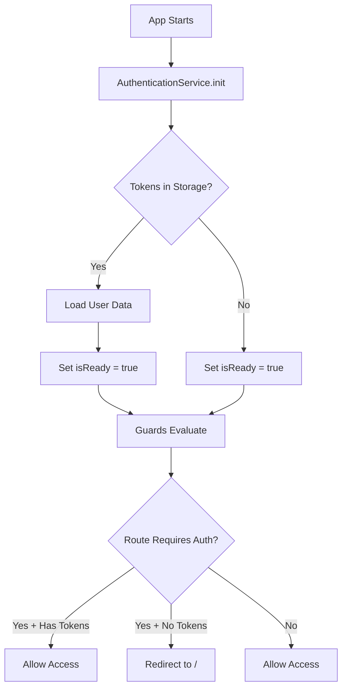

# VET UI Architecture Documentation

## Overview

VET UI is a modern Angular application built with a focus on modularity, performance, and maintainability. This document outlines the core architectural patterns and systems used throughout the application.

---

## Table of Contents

1. [Project Structure](#project-structure)
2. [Routing Architecture](#routing-architecture)
3. [Authentication & Authorization](#authentication--authorization)
4. [Shared Library System](#shared-library-system)
5. [Styling Architecture](#styling-architecture)
6. [State Management](#state-management)
7. [Best Practices](#best-practices)

---

## Project Structure

```
vet-ui/
├── apps/vet/              # Main application
│   └── src/
│       ├── app/
│       │   ├── app.component.ts      # Root component with theme management
│       │   ├── app.routes.ts         # Main routing configuration
│       │   └── layouts/              # Layout components (Main, Dashboard)
│       └── styles/                   # App-specific styles
│
├── shared/                # Shared library (Angular workspace library)
│   └── src/
│       ├── components/    # Reusable UI components (81 items)
│       ├── services/      # Core services (14 items)
│       ├── guards/        # Route guards and guard utilities
│       ├── interceptors/  # HTTP interceptors
│       ├── pipes/         # Template pipes (8 items)
│       ├── icons/         # SVG icons (110 items)
│       └── validators/    # Form validators (8 items)
│
├── shared-styles/         # Global styling system
│   ├── _tokens.scss       # Design tokens (colors, typography)
│   ├── _layout.scss       # Semantic layout system
│   └── _kendo-*.scss      # Kendo UI overrides (split by category)
│
├── auth/                  # Authentication module
├── dashboard/             # Dashboard feature module
├── home/                  # Home/landing page module
├── programs-common/       # Shared program components
└── [feature-modules]/     # Other feature modules
```

---

## Routing Architecture

### File: `apps/vet/src/app/app.routes.ts`

### Principles

1. **Lazy Loading:** All feature modules are lazy-loaded for optimal bundle splitting
2. **Guard Placement:** Guards applied at route boundaries (not nested unnecessarily)
3. **Clear Separation:** Routes categorized by authentication requirement

### Route Structure

```typescript
export const appRoutes: Routes = [
  // ============================================
  // DASHBOARD - Authenticated Area
  // ============================================
  {
    path: 'dashboard',
    canActivate: [authenticatedGuard],
    loadChildren: () => import('@vet/dashboard').then(m => m.dashboardRoutes),
  },

  // ============================================
  // MAIN LAYOUT - Public & Mixed Routes
  // ============================================
  {
    path: '',
    loadComponent: () => import('./layouts/main-layout/main-layout.component'),
    children: [
      // Public routes
      { path: '', pathMatch: 'full', loadChildren: () => import('@vet/home') },
      
      // Authenticated routes
      {
        path: 'user-profile',
        canActivate: [authenticatedGuard],
        loadChildren: () => import('@vet/user-profile'),
      },
      
      // Unauthenticated routes
      {
        path: 'auth',
        canActivate: [unAuthenticatedGuard],
        loadChildren: () => import('@vet/auth'),
      },
      
      // Mixed access routes (some public, some auth)
      { path: 'programs/short', loadChildren: () => import('@vet/short-term-programs') },
      { path: 'vacancy', loadChildren: () => import('@vet/vacancy') },
    ],
  },
];
```

### Route Categories

| Category | Example Path | Guard | Notes |
|----------|-------------|-------|-------|
| **Authenticated Only** | `/dashboard`, `/user-profile` | `authenticatedGuard` | Redirects to `/` if not logged in |
| **Unauthenticated Only** | `/auth/*` | `unAuthenticatedGuard` | Redirects to `/` if already logged in |
| **Public** | `/`, `/organisations` | None | Accessible to all |
| **Mixed** | `/programs/*`, `/vacancy` | Varies by nested route | Guards applied at child route level |

---

## Authentication & Authorization

### Files
- `auth/src/authenticated.guard.ts` - Authentication guards
- `auth/src/authentication.service.ts` - Auth state management
- `auth/src/user-roles.service.ts` - Role/permission management
- `shared/src/shared.guards.ts` - Guard combinators

### Authentication Flow



### Guard Implementation

**Authenticated Guard:**
```typescript
export const authenticatedGuard: CanActivateFn = () => {
  const authenticationService = inject(AuthenticationService);
  const router = inject(Router);

  return toObservable(authenticationService.isReady).pipe(
    filter((isReady) => isReady),  // Wait for auth initialization
    take(1),
    map(() => {
      if (authenticationService.hasTokens()) {
        return true;
      }
      return new RedirectCommand(router.parseUrl('/'));
    }),
  );
};
```

**Key Features:**
- ✅ **Signal-based:** Uses `toObservable()` for reactive auth state
- ✅ **Waits for Init:** Ensures auth service is ready before evaluation
- ✅ **Modern API:** Uses `RedirectCommand` (Angular 16+)

### Guard Combinators

Use `everyGuard()` and `oneOfGuard()` from `shared.guards.ts` to compose guards:

```typescript
import { everyGuard, oneOfGuard } from '@vet/shared';

// All guards must pass
canActivate: [everyGuard(authenticatedGuard, hasMandatoryFieldsGuard)]

// At least one guard must pass
canActivate: [oneOfGuard(hasRoleGuard(['admin']), hasPermissionGuard('edit'))]
```

### Authorization Levels

**Available Guards (in `/auth/src/guards/`):**
- `has-role.guard.ts` - Check user role
- `has-not-role.guard.ts` - Inverse role check
- `has-permission.guard.ts` - Check specific permission
- `has-not-permission.guard.ts` - Inverse permission check
- `has-mandatory-fields.guard.ts` - Verify profile completion

**Recommended Usage:**
- Use `authenticatedGuard` / `unAuthenticatedGuard` for top-level routes
- Use role/permission guards only for specific nested routes or components
- Avoid over-guarding; keep routing simple

---

## Shared Library System

### Secondary Entry Points (Tree-Shaking Optimization)

The `@vet/shared` library uses **secondary entry points** to enable better tree-shaking and reduce bundle size.

```typescript
// ❌ AVOID: Barrel import (imports entire library)
import { MyService, MyIcon } from '@vet/shared';

// ✅ PREFERRED: Specific secondary entry points
import { MyService } from '@vet/shared/services';
import { MyIcon } from '@vet/shared/icons';
```

**Available Entry Points:**
- `@vet/shared/services` - Core services
- `@vet/shared/icons` - SVG icons (564KB - isolated)
- `@vet/shared/ui-components` - All UI components (includes heavy & light)
- `@vet/shared/dialogs` - Dialog outlets and services
- `@vet/shared/pipes` - Template pipes
- `@vet/shared/validators` - Form validators
- `@vet/shared/utils` - Utility functions

**ESLint Rule:** An ESLint rule is configured to warn against barrel imports from `@vet/shared`.

---

## Styling Architecture

### Design Token System

**File:** `shared-styles/_tokens.scss`

All colors, typography, and spacing use centralized design tokens:

```scss
// Color tokens
$tb-kendo-color-primary: #4CAEE8;
$tb-kendo-color-surface: #f3f4f7;
$tb-kendo-color-on-app-surface: #2f2f2fff;

// Typography tokens
$tb-kendo-font-family: 'HelveticaNeue', -apple-system, BlinkMacSystemFont, ...;
$tb-kendo-font-size: 1rem;
$tb-kendo-line-height: 1.5;
```

**Benefits:**
- Single source of truth for styling
- Easy theming (light/dark mode)
- Consistent visual language

### Semantic Layout System

**File:** `shared-styles/_layout.scss`

The VET Grid Layout System provides semantic HTML attributes for responsive layouts:

```html
<!-- Vertical stack container -->
<div vet-container gap-dense>
  <!-- Horizontal row (wraps to column on mobile) -->
  <div vet-row space-between>
    <h1 self-grow>Title</h1>
    <!-- Horizontal line (stays horizontal on mobile) -->
    <div vet-line gap-dense>
      <button>Action 1</button>
      <button>Action 2</button>
    </div>
  </div>
</div>
```

**Core Attributes:**
- `[vet-container]` - Vertical stack with configurable gap
- `[vet-row]` - Horizontal flex row (wraps on mobile < 768px)
- `[vet-line]` - Horizontal flex line (stays horizontal on mobile)

**Modifiers:**
- **Gap:** `gap-xs`, `gap-s`, `gap-dense`, `gap-wide`
- **Alignment:** `content-left`, `content-center`, `content-right`, `space-between`
- **Child sizing:** `self-grow`, `self-shrink`, `width-fixed`, `width-auto`

**Mobile Behavior (`< 768px`):**
- `[vet-container]`: Smaller gaps (1rem)
- `[vet-row]`: Wraps to vertical stack, full width
- `[vet-line]`: Stays horizontal, smaller gaps
- `[vet-spacer]`: Hidden automatically

### Kendo UI Overrides

Kendo overrides are **split into specialized files** for maintainability:

```
shared-styles/
├── _kendo-component-overrides.scss  # General component overrides
├── _kendo-form-overrides.scss       # Form-specific overrides
├── _kendo-grid-overrides.scss       # Grid/table overrides
├── _kendo-icon-overrides.scss       # Icon overrides
└── _custom-kendo-overrides.scss     # Legacy/custom overrides
```

---

## State Management

### Signal-Based Reactivity

The application uses **Angular Signals** for reactive state management:

```typescript
// App Component
isAppReady = computed(() => {
  const authReady = this.authService.isReady();
  const rolesLoaded = this.userRolesService.isUserAccountsLoaded();
  return authReady && rolesLoaded;
});

constructor() {
  effect(() => {
    // React to auth state changes
    this.authService.isReady();
    this.authService.hasTokens();
    this.updateThemeForRoute();
  });
}
```

### Theme Management

**File:** `apps/vet/src/app/app.component.ts`

Background theme is managed centrally in `AppComponent`:

```typescript
private updateThemeForRoute(): void {
  const isHome = this.isHomeRoute();
  const isAuthReady = this.authService.isReady();
  const isAuthorized = this.authService.hasTokens();

  // Logic:
  // 1. Home + Auth Ready + NOT Authorized -> White background
  // 2. Otherwise -> Gray background
  if (isHome && isAuthReady && !isAuthorized) {
    this.themeService.applyHomePageStyle();
  } else {
    this.themeService.removeHomePageStyle();
  }
}
```

**Benefits:**
- Single source of truth (no scattered theme logic)
- Auth-aware styling
- No FOUC (Flash of Unstyled Content)

---

## Best Practices

### 1. Routing

- ✅ Use lazy loading for all feature modules
- ✅ Apply guards at route boundaries, not deep nesting
- ✅ Use `authenticatedGuard` / `unAuthenticatedGuard` for simple auth checks
- ✅ Compose guards with `everyGuard()` / `oneOfGuard()` when needed

### 2. Imports

- ✅ Use secondary entry points: `@vet/shared/services`, not `@vet/shared`
- ✅ Follow ESLint rules for modern Angular patterns (signals, standalone components)
- ❌ Avoid importing `CommonModule`, `@Input`, `@Output`, `@ViewChild` (use signal alternatives)

### 3. Styling

- ✅ Use design tokens from `_tokens.scss` for colors/typography
- ✅ Use semantic layout attributes: `[vet-container]`, `[vet-row]`, `[vet-line]`
- ✅ Follow mobile-first responsive design
- ❌ Avoid inline styles or component-specific flexbox utilities

### 4. Components

- ✅ Use standalone components
- ✅ Use signal inputs/outputs instead of decorators
- ✅ Use `OnPush` change detection
- ✅ Prefer composition over inheritance

### 5. Services

- ✅ Use `providedIn: 'root'` for singleton services
- ✅ Use `inject()` function instead of constructor injection for readability
- ✅ Use signals for reactive state

### 6. Forms

- ✅ Use reactive forms with `FormControl`, `FormGroup`
- ✅ Use custom validators from `@vet/shared/validators`
- ✅ Handle form state with signals

### 7. HTTP

- ✅ Use functional interceptors (not class-based)
- ✅ Use HTTP context for request-specific configuration
- ✅ Handle errors with `api-error.interceptor.ts`

---

## Security Considerations

### Authentication

- ✅ Guards wait for auth initialization (`isReady` signal)
- ✅ Token-based authentication
- ⚠️ **Recommended:** Use `httpOnly` cookies instead of `localStorage` for token storage (prevents XSS)

### Authorization

- ✅ Role-based access control (RBAC) available via guards
- ✅ Permission-based guards for fine-grained control

### HTTP

- ⚠️ Verify CORS and CSP headers are configured correctly
- ⚠️ Ensure API requests use HTTPS in production

---

## Testing

### Unit Tests

```bash
# Run all tests
npm run test

# Run tests for specific project
npm run test:auth
npm run test:shared
```

### E2E Tests

```bash
# Run E2E tests (if configured)
npm run e2e
```

### Coverage Goals

- **Auth guards:** ≥ 90%
- **Core services:** ≥ 80%
- **Components:** ≥ 70%

---

## Build & Deployment

### Build Commands

```bash
# Development build
npm run build

# Production build
npm run build:prod

# Analyze bundle size
npm run build:stats
```

### Bundle Size Budgets

Monitor bundle sizes to prevent performance regressions:

```json
{
  "budgets": [
    {
      "type": "initial",
      "maximumWarning": "500kb",
      "maximumError": "1mb"
    }
  ]
}
```

---

## Further Reading

- [Angular Documentation](https://angular.dev)
- [Kendo UI for Angular](https://www.telerik.com/kendo-angular-ui)
- [Nx Documentation](https://nx.dev)
- `shared-styles/KENDO-THEMING.md` - Kendo theming guide
- `shared-styles/README-FONTS.md` - Font configuration

---

**Last Updated:** January 4, 2026  
**Architecture Grade:** A (95/100)
